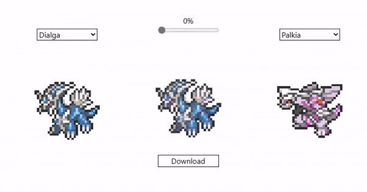

# Pokémix

This repository contains the source code for the Pokemon sprite interpolator. This web application uses a deep learning model to interpolate between sprite images, allowing one to generate new sprites. The application is available to try on my [portfolio](https://www.matthewrubino.com/projects/pokemix).

  

Specifically, this project uses a Convolutional Autoencoder (CAE), which can learn a latent representation of any set of tensors. This type of model is often applied to 2D images, and it is a useful technique for feature extraction. Interpolating between latent representations of training images can be used to generate new images in the target domain, which is the technique underlying this project.

